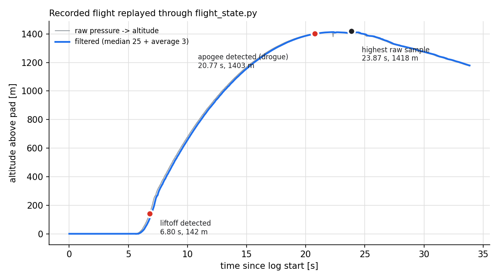

# rocket-avionics

Parachute recovery code for HORNET X, a solid-propellant sounding rocket built
by the Sapienza Rocket Team.

The flight computer reads pressure off a BMP388, filters it, turns it into
altitude and fires the two pyro channels once it decides the rocket has stopped
going up.

## Where this comes from

I was in the Sapienza Rocket Team Training Academy 2024/2025, team 7, from
September 2024 to May 2025, when HORNET X launched. My role was in recovery: I
did the MATLAB work for the parachute system. Since I had already done some
programming on my own, I also helped the avionics group, and this code is the
part of that work I wrote.

It was the first time I used Python for a real project, and that was the hard
part. The two things I had to study for it were Python itself and the median
filter.

What's in here is that same logic, tidied up and with tests around it. HORNET X
did fly, but not with this on board: on launch day we used the team's own
flight computer, so everything below was only ever checked in simulation and
in replay.

## The rocket

A 75 mm airframe about 66 cm long: a 3D-printed PLA ogive nose over a Kraft
phenolic body tube, trapezoidal fins, ballast up front to move the centre of
gravity forward. Recovery was sized for a 1 kg vehicle coming down at 3 m/s
under a cruciform chute of 0.73 m side, which is where the ejection charge and
shock cord loads came from.

The flight I replay in `tools/replay.py` is a different and much larger team
vehicle, reaching about 1410 m above the pad some 16 s after leaving it,
against the few hundred metres and roughly 10 s HORNET X was built for. The
detection logic is the same either way, but the numbers it has to work with are
not.

## What it does

Two states. On the pad it keeps sampling until the altitude moves more than 3 m
between two consecutive samples, and calls that liftoff. From then on it looks
for two samples less than 10 cm apart, calls that apogee, fires the drogue,
waits a second and fires the main.

Each reading goes through a median filter over the last 25 samples, then a
3-point moving average, and only then becomes an altitude with the standard ISA
formula. Everything gets written to a CSV while the loop runs.

The team's OpenRocket model puts apogee in the mid-500s, but its motor and its
mass don't agree with the 1 kg the recovery was sized around, so I read that as
a design target rather than a prediction.

### What the thresholds mean

Both thresholds are distances between two consecutive samples, so they are
really speeds, and which speed depends on the loop period:

| threshold | at 20 ms (my loop) | at 12.5 ms (replayed flight) |
|-----------|--------------------|------------------------------|
| liftoff, > 3 m   | > 150 m/s | > 240 m/s |
| apogee, < 10 cm  | < 5 m/s   | < 8 m/s   |

So liftoff is only flagged once the rocket is already moving fast, which is
why it fires late. And 10 cm is about one pascal at pad altitude, the
resolution of the recorded data. On the pad of the replayed flight, 86% of raw
sample pairs and every filtered pair are already less than 10 cm apart: the
apogee check would fire on the ground if the liftoff check didn't gate it.

The median over 25 samples is 0.5 s of data at 20 ms. It removes single-sample
spikes, but on a steady climb the median is the middle sample, so the altitude
lags by 12 samples (about 0.24 s at 20 ms, 0.15 s at 12.5 ms), plus one more
from the 3-point average. That is part of the late liftoff.

## Results on a recorded flight



```bash
python tools/replay.py /abs/path/femu/data/flight.csv
python tools/plot_replay.py /abs/path/femu/data/flight.csv   # writes figures/replay.png
```

`replay.py` feeds a recorded flight through the same filter and state machine
the flight loop uses. On the one flight I replayed (6375 samples, 12.5 ms
apart, pad at about 1345 m above sea level by ISA):

- liftoff is flagged at 142 m, about a second after the rocket leaves the pad;
- the drogue fires at 20.77 s, at 1403 m, with the rocket still climbing at
  about 13 m/s.

What that apogee error is depends on what you call the true apogee. The script
compares against the single highest raw sample, at 23.87 s and 1418 m, which
gives 3.1 s early and 15 m low. But that sample is a spike: in the figure the
raw curve is flat around 1410 m from about 21.5 s to 23 s, and averaging the
raw altitude over one second puts the peak near 21.7 s. A body going up at
13 m/s and slowing at g (no drag) has v/g ≈ 1.4 s and v²/2g ≈ 9 m left to go.
So a fairer statement is about one to one and a half seconds early and about
10 m low.

What these numbers don't show: one flight, of a different rocket, sampled at a
different rate than the one the thresholds were picked for, replayed offline.
They say the logic fires early on this data; they don't say how early it would
fire on HORNET X.

## Sources and where I use them outside their range

- **Altitude**: the barometric formula for the ISA troposphere
  (ISO 2533:1975, same as the U.S. Standard Atmosphere 1976 below 11 km), with
  p0 = 101325 Pa, T0 = 288.15 K, L = 0.0065 K/m, g = 9.80665 m/s²,
  R = 287.05 J/(kg K). It assumes a standard day. On a real day the ground
  temperature and pressure are different, so the absolute altitude is off; the
  altitude *difference* from the pad is much less affected, but the code does
  not subtract the pad altitude (see below).
- **Sensor**: Bosch BMP388 datasheet, BST-BMP388-DS001, rev. 1.7, Nov 2020.
  Operating range 300–1250 hPa; absolute accuracy ±0.50 hPa
  (300–1100 hPa, −20…+65 °C); relative accuracy ±0.08 hPa, about ±66 cm, but
  only for 900–1100 hPa at 25–40 °C. The replayed flight goes from about
  862 hPa at the pad to about 722 hPa at apogee, **below the range where the
  relative accuracy is specified**, so the datasheet says nothing about
  whether 10 cm steps are meaningful there. I don't know which sensor recorded
  that flight or with which oversampling setting.
- **OpenRocket**: the team model, used only as a design target, for the reason
  given above.
- **FEMU and the flight log**: the team's simulator and a team flight
  recording, used with the team's permission. Neither is in this repo.

## Layout

```
avionics/
  atmosphere.py     pressure -> altitude (ISA)
  filters.py        median + moving average
  flight_state.py   liftoff / apogee detection
  recorder.py       CSV flight log
  main.py           the flight loop
flight.py           entry point
tests/              pytest suite
tools/replay.py     replay a recorded flight through the detection logic
tools/plot_replay.py  same replay, as the figure above
figures/            generated figures
vendor/             team-supplied stubs and simulator driver
```

## Tests

```bash
pip install -r requirements.txt
python -m pytest
```

Eleven of them, covering the atmosphere math, the filter and the state machine.
No hardware or simulator involved. They show that the formula, the median and
the two checks do what the code says; they don't show that the thresholds are
right. Tested with Python 3.10.12, pytest 9.1.1 and matplotlib 3.10.9.

The flight code itself needs nothing outside the standard library; pytest is
only for the tests and matplotlib only for `tools/plot_replay.py`.

## Running a simulated flight

`vendor/stubs.py` and `vendor/testDriver.py` are in the repo. `stubs.py` fakes
the MicroPython pieces that CPython doesn't have (`time.sleep_ms`, `machine`).
`testDriver.py` talks to the simulator over stdin/stdout; on the real board it
gets swapped for `driver.py`, same interface. Neither of them is mine, they come
from the team.

What you need from outside is FEMU, the team's simulator, in a folder next to
this one, and a recorded flight to replay: a CSV of `time_ms,pressure_Pa` rows,
which I keep in `femu/data/` rather than in here.

From the folder that contains `femu`:

```bash
PYTHONUNBUFFERED=1 python -m femu /abs/path/femu/data/flight.csv /abs/path/flight.py
```

Both bits matter. Without `PYTHONUNBUFFERED=1` the two processes end up waiting
on each other's buffered output and nothing happens, with no error to tell you
why. The paths have to be absolute because femu changes working directory before
it starts the script.

## The log

`logs/flight_log.csv`, no header, one row per sample:

```
timestamp, filtered_pressure_Pa, raw_pressure_Pa, state, parachute
```

`state` is 3 on the pad and 2 in flight, `parachute` is 0 or 1. The file opens
in append mode, so delete it between runs or you'll get two flights in one.

## What's still wrong with it

The two checks look at a single pair of samples and compare absolute
differences, so they can't tell a climb from a descent, and one quiet pair is
enough to trigger a deployment.

The thresholds are per sample rather than per second, so they only mean what I
think they mean at the loop rate I picked (20 ms).

Altitude is above sea level. Nothing zeroes it on the pad.

The loop exits right after the main charge, so none of the descent is logged and
there's no landing detection.

`time.monotonic()` works only because of the CPython stubs. On the board it
would need `time.ticks_ms()`.

`tools/replay.py` takes the highest raw sample as the true apogee, which a
single spike can move, as it does on the replayed flight.

I've left the detection logic as I wrote it in the Training Academy rather than
patching it afterwards. What's new here is the measurement, and the list above
is the order I'd fix things in.

## Author

Fabio Alexandru Mitrea

## License

MIT, see [LICENSE](LICENSE). The files in `vendor/` belong to the Sapienza
Rocket Team and are not covered by it.
